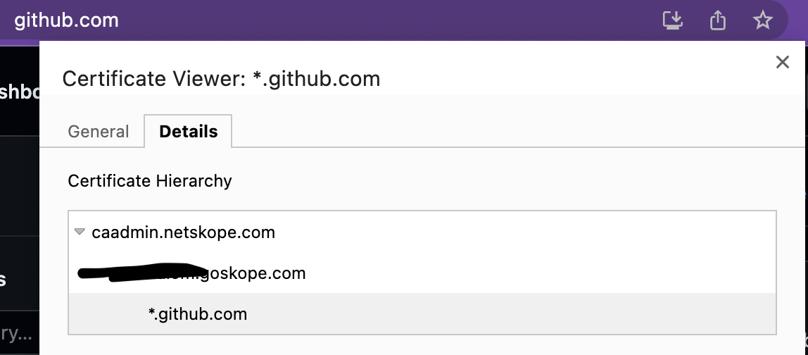

I went down quite a rabbit hole while trying to follow the guided tour over at https://www.jenkins.io/doc/pipeline/tour/getting-started/

Perhaps someone out there did as well?

## The issue

sun.security.provider.certpath.SunCertPathBuilderException: unable to find valid certification path to requested target

## The Error in Plain English

The Jenkins JVM does not trust the CA cert that the software uses.

## How to Reproduce (Short)

- Run Jenkins locally (`java -jar jenkins.war --httpPort=8080`)
- Use github.com as the remote repository
- [Follow the Jenkins Guided Tour](https://www.jenkins.io/doc/pipeline/tour/hello-world)

## How To Reproduce (Detailed)

On the Jenkins site, `/getting-started` begins by giving us the below instructions:

### Download and run Jenkins[](https://www.jenkins.io/doc/pipeline/tour/getting-started/#download-and-run-jenkins)

1. [Download Jenkins Generic Java package (.war)](https://www.jenkins.io/download)

2. Open up a terminal in the download directory

3. Run `java -jar jenkins.war --httpPort=8080`

4. Browse to `http://localhost:8080`

5. Follow the instructions to complete the installation

This works fine.

The challenge is in the first instructions over at
**[Continue to "Create your first Pipeline"](https://www.jenkins.io/doc/pipeline/tour/hello-world)**

- Install the recommended plugins
- Install the [**Docker Pipeline plugin**](https://plugins.jenkins.io/docker-workflow/) through the **Manage Jenkins > Plugins** page
- Make a Jenkinsfile (`touch Jenkinsfile`)
- Throw the below config into it

```
/* Requires the Docker Pipeline plugin */
pipeline {
    agent { docker { image 'node:18.16.0-alpine' } }
    stages {
        stage('build') {
            steps {
                sh 'node --version'
            }
        }
    }
}
```

- Configure a github repository and put the Jenkinsfile in it
- On the Jenkins Dashboard (localhost:8080), set up the following
  - add github credentials  
    (Branch Sources > GitHub Credentials)
  - point Jenkins to my repository  
    (HTTPS URL field. - Branch Sources > Repository HTTPS URL)

---

Much to my bewilderment, I very quickly run into errors when clicking "validate" against the HTTPS url (in my case, https://github.com/MSoup/jenkins-learning.git)

Upon checking the Jenkins build pipeline, I came across the following:

```
sun.security.provider.certpath.SunCertPathBuilderException: unable to find valid certification path to requested target
	at java.base/sun.security.provider.certpath.SunCertPathBuilder.build(SunCertPathBuilder.java:146)
	at java.base/sun.security.provider.certpath.SunCertPathBuilder.engineBuild(SunCertPathBuilder.java:127)
	at java.base/java.security.cert.CertPathBuilder.build(CertPathBuilder.java:297)
	at java.base/sun.security.validator.PKIXValidator.doBuild(PKIXValidator.java:434)
Caused: sun.security.validator.ValidatorException: PKIX path building failed
	at java.base/sun.security.validator.PKIXValidator.doBuild(PKIXValidator.java:439)
	at java.base/sun.security.validator.PKIXValidator.engineValidate(PKIXValidator.java:306)
	at java.base/sun.security.validator.Validator.validate(Validator.java:264)
	at java.base/sun.security.ssl.X509TrustManagerImpl.checkTrusted(X509TrustManagerImpl.java:231)
	at java.base/sun.security.ssl.X509TrustManagerImpl.checkServerTrusted(X509TrustManagerImpl.java:132)
	at java.base/sun.security.ssl.CertificateMessage$T13CertificateConsumer.checkServerCerts(CertificateMessage.java:1341)
Caused: javax.net.ssl.SSLHandshakeException: PKIX path building failed: sun.security.provider.certpath.SunCertPathBuilderException: unable to find valid certification path to requested target
	at java.base/sun.security.ssl.Alert.createSSLException(Alert.java:131)
	at java.base/sun.security.ssl.TransportContext.fatal(TransportContext.java:378)
	at java.base/sun.security.ssl.TransportContext.fatal(TransportContext.java:321)
	at java.base/sun.security.ssl.TransportContext.fatal(TransportContext.java:316)
	at
```

## The Explanation: The Jenkins JVM does not trust the CA cert that the software uses.

There is software running on your machine that does MITM SSL checks. The Jenkins JVM does not trust the CA cert here.

## The solution

There are three steps to resolving this:

1. Find which Java path you are using

```
% which java
/opt/homebrew/opt/openjdk@17/bin/java
```

2. Download that certificate from the site you are trying to connect to. In my case, it was github, so I went to github.com and clicked on the "lock" icon (I am using Chrome but Firefox and other browsers should still have a similar feature).

There is a setting in there where you can export that SSL certificate. Make sure the parent certificate is highlighted before you click export. It will not work if you only export \_.github.com.

You absolutely must export the parent certificate.

### Example


In the above image, .github.com is highlighted, this is the wrong certificate.
Verify that you have successfully exported the certificate:

```
% openssl verify ~/Downloads/caadmin.netskope.com.cer
/Users/d/Downloads/caadmin.netskope.com.cer: OK
```

3. Get your JVM to trust that certificate!

This involves adding it to the proper keystore. Which keystore is the proper one? Why, it's the one associated with the java installation you are using to run Jenkins. In my case, it the one around this area:

```
/opt/homebrew/opt/openjdk@17/bin
```

Here's where it gets tricky. We need to use the `keytool` command located here to import the certificate that you downloaded from github. Here's what it might look like

(Executed from the path that contains `caadmin.netskope.cer`)

```
% keytool -import -trustcacerts -keystore /opt/homebrew/Cellar/openjdk@17/17.0.8/libexec/openjdk.jdk/Contents/Home/lib/security/cacerts -storepass changeit -noprompt -alias github_cert -file caadmin.netskope.cer
```

Hope this helps! A lot of the guides and answers on stackoverflow may give you some troubles, as they do not account for Apple Silicon setups where JAVA_HOME may not exist.
